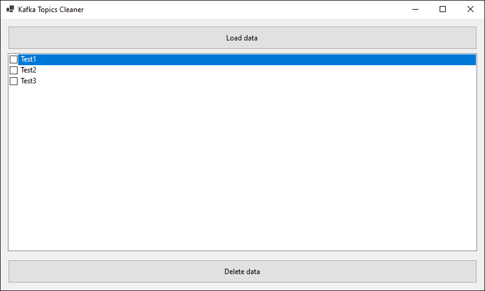

# KafkaCleaner
Helper utility for cleaning data in Apache Kafka. 



Allows to ignore system or reserved topics.

```yaml
{
  "KafkaServiceClientConfiguration": {
    "MetadataTimeout": "00:00:05",
    "BootstrapServers": [
      "kafka:9092"
    ],
    "ReservedTopics": [
      "__consumer_offsets"
    ]
  }
}
```

Also this application could be considered as example of how to use Microsoft DI and Serilog in Windows Forms App.
